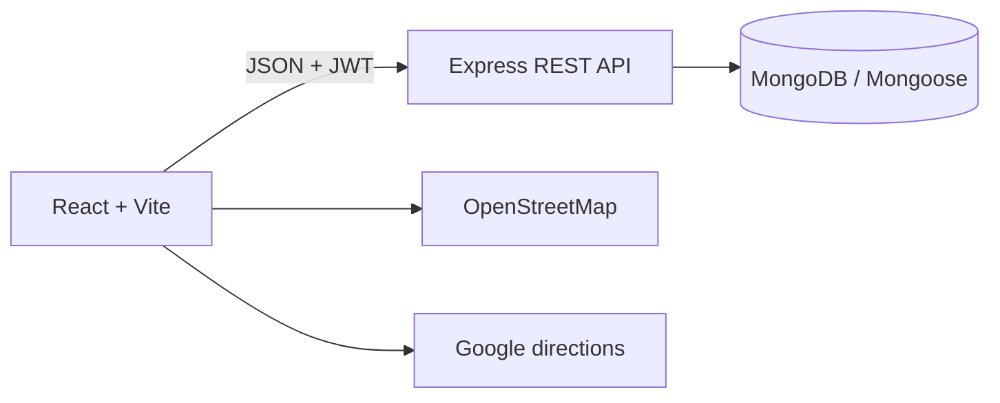
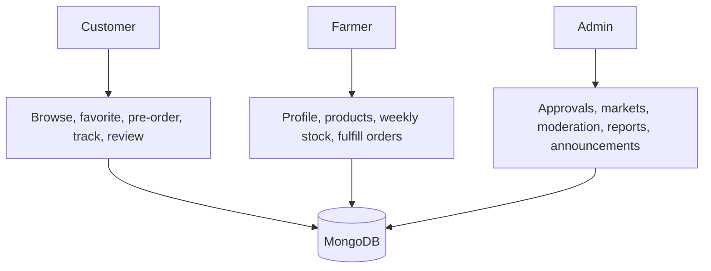
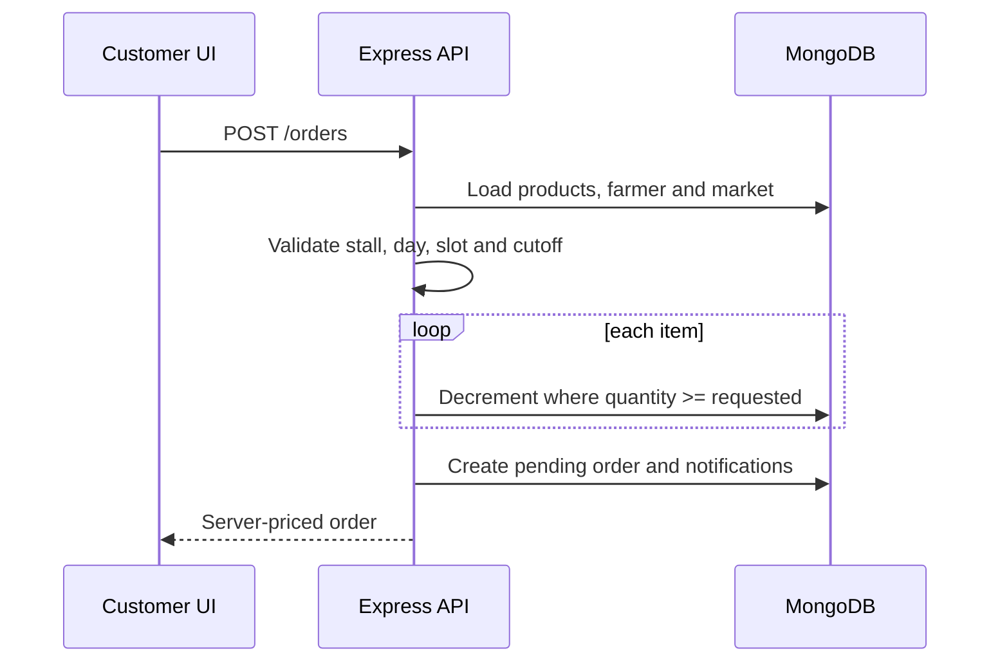

# Architecture and flows

## Scope

MarketLink connects customers with approved local farmers for pre-orders collected at configured community markets. Payment occurs at pickup. Delivery, online payment, email/SMS delivery and a production AI service are outside the current scope.

The browser stores only the JWT, cached session display data, UI theme and temporary cart. MongoDB is authoritative for business data.

## Use cases and context

## Checkout flow

Decisions:
- Categories use stable slugs: `vegetables`, `fruits`, `dairy`, `baked-goods`.
- A basket has one farmer and market because availability/cutoff rules are farmer-specific.
- Applying a weekly template copies values to `Product`; orders never mutate templates.
- Revenue means completed-order revenue.
- Deploy with `TZ=Asia/Karachi` so cutoff interpretation matches the business timezone.
