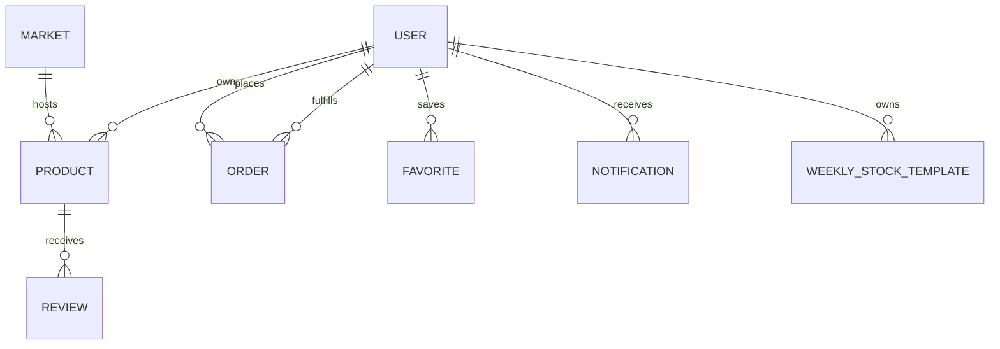

# Database design

| Collection | Main fields | Indexes/references | Validation |
|---|---|---|---|
| User | identity, role/status, contact, farmer schedule/cutoff/coordinates | unique email; market refs | bcrypt password, enums, coordinate bounds |
| Market | name, address, GeoJSON, days/hours, active | `2dsphere` | required real coordinates and day enum |
| Product | farmer, market, category, unit, price, quantity, rating aggregate | farmer/market, text | non-negative price/stock; category allowlist |
| Order | customer/farmer/market, item snapshots, total, pickup, status, restoration | customer/farmer/status | positive quantity; validated status/pickup |
| Favorite | user, target, type, restockAlert | unique user/type/target | customer-only routes |
| Review | product/farmer/customer, rating/comment/response/status | unique product/customer | rating 1–5; completed purchase |
| Notification | user, type, message, related entities, read, eventKey | user/read; unique sparse event key | event type enum |
| Announcement | title/message/audience, active, dates, creator | active/publish | bounded text and audience enum |
| WeeklyStockTemplate | farmer/market/day, entries, overrides, enabled | unique farmer/market/day/name | owned products; non-negative values |

